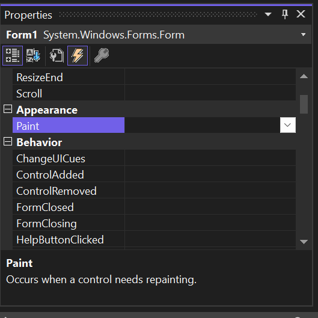
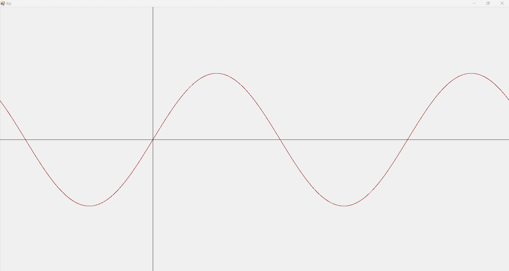
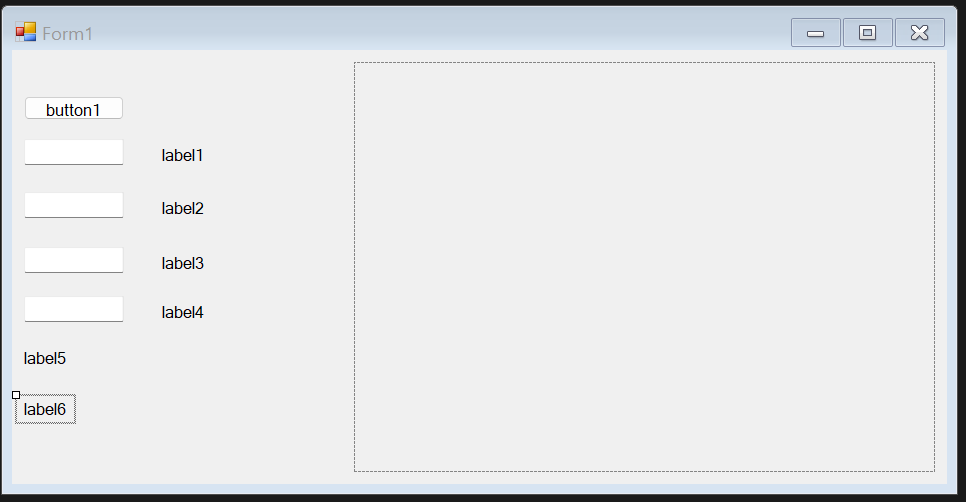
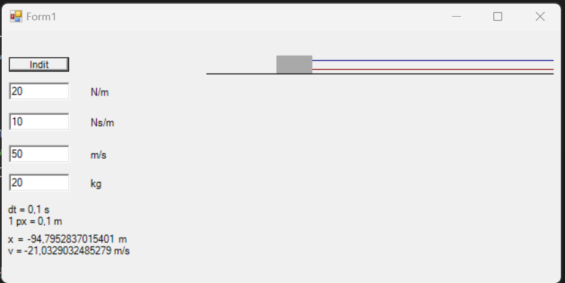
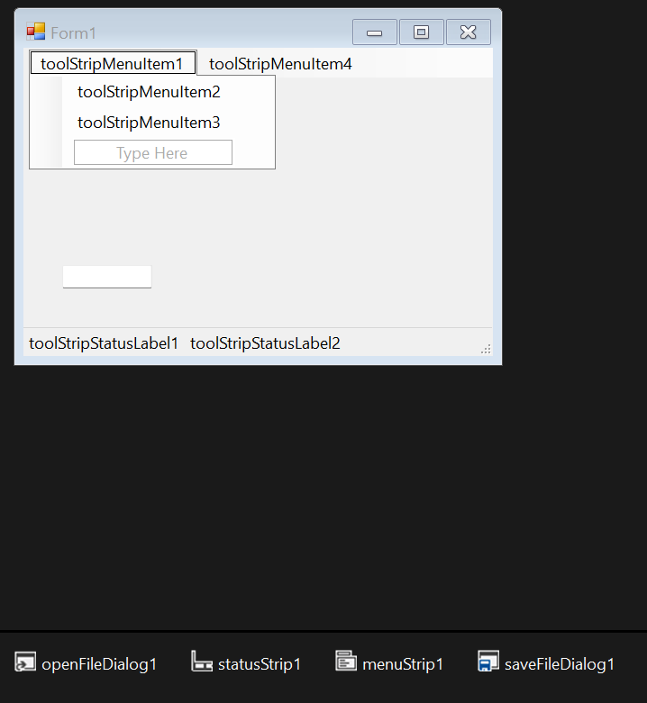
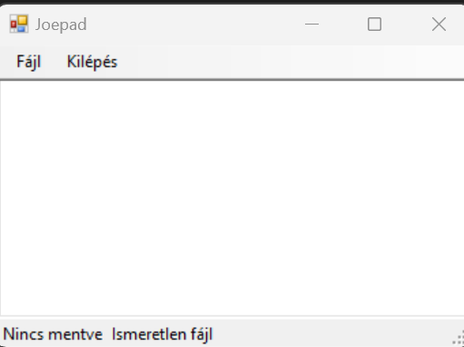

# Tartalom

- [C++/CLI alapjai](#ccli-nyelv-alapjai)  
  - [Példa: C++ kód átalakítása C++/CLI-be](#példa-c-kód-átalakítása-ccli-be)
- [Grafikus felületek alapjai](#grafikus-felületek-alapjai)
  - [Példa: szám prím osztóinak meghatározása](#példa-szám-prím-osztóinak-keresése)
- [Grafikus Rajzolás a C++/CLI-ben](#grafikus-rajzolás-a-ccli-ben)
  - [Rajzolás a CreateGraphics függvénnyel](#creategraphics-használata-rajzoláshoz-formon)
  - [Példa: f(x) = sin(x * PI) megjelenítése](#példa-függvény-kirajzolása)
  - [Rajzolás PictureBox használatával](#rajzolás-picturebox-használatával)
  - [Példa: Rezgéstani szimulátor írása](#példa-rezgéstani-szimulátor)
- [Fájlkezelés FileDialog használatával](#fájlkezelés-filedialog-használatával)
  - [Példa: Notepad a C++/CLI-ben](#példa-szövegszerkesztő-ccli-ben)

# C++/CLI nyelv alapjai

A C++/CLI a Microsoft külön programnyelve, amivel a .NET platformra lehet C++ kódot írni. Emiatt gyakran a C# nyelvhez szokták hasonlítani.  

A C++/CLI egyik legfontosabb különbsége az, hogy a C++ alap típusai változtak: habár azonos a nevük, valójában osztályok. Az olyan átalakítások, mint a `double(valtozo)` helyett a `Convert::ToDouble`-höz hasonló szintaxot kell használni, valamint körülbelül minden típusnak van `.ToString()` tagfüggvénye.  

Ezen kívül a pointerek is mások lettek: azért, hogy ne kelljen a `delete`-t hívni mindenen, speciális típusok egy ú.n. garbage collector (GC) használatával szabadulnak fel. Ezeket csillag helyett a `^` karakterrel jelöljük, létrehozásuknál a `gcnew` kulcsszót használjuk:

~~~C++
String^ osztaly = gcnew String;

osztaly += L"ő-t használhatsz, ha az idézőjel előtt van L";
osztaly += label1->Text;

// nincs delete :)
~~~

Amint látni lehet, a `String` most nagy betűvel van, ugyanis a C++/CLI más osztályokkal dolgozik, mint amiket mi kezeltünk még MOO keretein belül (habár azok is alkalmazhatóak egyes esetekben).
A következők a legfontosabbak:

- `String`: szövegek
- `cli::array<T>^`: dinamikus tömb
- `List<T>^`: bővíthető tömb, mint a C++ vector
- `Random`: random számgenerátor
- `StreamWriter` és `StreamReader`: fájl írás és olvasás
- `CultureInfo`: a nyelvektől függő beállítások (pl.: CSV elválasztókarakter) lekérése

Ezen kívül az osztályainknak egy új tulajdonság beállítása van: a `property`. Egy propertyvel úgy tudunk egy függvényt hívni az osztályon, mintha egy adattag lehetne. Egy property rendelkezhet egy `get()` és egy `set(ertek)` függvénnyel, amivel például privát elemeket lehet módosítani az osztályban.

---

## Példa: C++ kód átalakítása C++/CLI-be

Feladat: Készítjünk egy pénzügyi adatfeldolgozó osztályt! A konstruktor kérjen egy stringet, ami megadja az osztálynak, hogy melyik (CSV formátumú) fájlt olvassa be!  
A fájl soraból olvasd ki `bevetel;kiadas` formátumban az akkori bevételeket, kiadásokat (ezek double-ök)!  
Az osztálynak csinálj 3 függvényt, amik:

- Visszaadják, hogy hány elem van
- Visszaadják az átlagos profitot ($\sum bevetel - \sum kiadas\over{elemszam}$)

C++ megoldás:

~~~C++
#include <iostream>
#include <string>
#include <fstream>
#include <sstream>

using namespace std;

class adatfeldolgozo {
    double bevetelek, kiadasok;
    unsigned int elemszam;
public:
    adatfeldolgozo(string fajlnev) :
    bevetelek(0), kiadasok(0), elemszam(0) {
        ifstream fajl(fajlnev);
        stringstream converter;
        string sor;
        if (!fajl.is_open()) {
            cout << "Nem sikerult a(z) \"" <<
            fajlnev << "\" fajlt megnyitni!" << endl;
            exit(-1);
        }

        while (!fajl.eof()) {
            getline(fajl, sor);
            if (sor.length() == 0) continue;

            string bevs, kiads;
            size_t elvHely = sor.find(";");
            if (elvHely == string::npos) continue;
            bevs = sor.substr(0, elvHely);
            kiads = sor.substr(elvHely + 1);

            double tempBev, tempKiad;
            converter << bevs << endl;
            converter >> tempBev;

            converter << kiads << endl;
            converter >> tempKiad;

            elemszam++;
            bevetelek += tempBev;
            kiadasok += tempKiad;
        }

        fajl.close();
    }

    unsigned int elemek() { return elemszam; }

    double atlagprofit() {
        return (bevetelek - kiadasok) / elemszam;
    }

};

const string inputfajl = "ZH 1\\feladatok\\adat3.csv";

int main() {
    adatfeldolgozo adatok(inputfajl);
    
    cout << adatok.elemek() << " elembol " <<
    adatok.atlagprofit() << " Ft atlag profit lett" << endl;
}
~~~

---

Ehhez képest a C++/CLI a következő módon csinálja:

~~~C++
#include "pch.h"
using namespace System::IO;
using namespace System::Windows;
using namespace System;
using namespace System::Globalization;

ref class adatfeldolgozo {
    double bevetelek, kiadasok;
    unsigned int elemszam;
public:
    adatfeldolgozo(String^ fajlnev): elemszam(0), bevetelek(0), kiadasok(0) {
        // ahhoz, hogy tizedespontot olvassunk, amerikai kultúrát
        // fogunk használni string-double átalakításnál
        // (ha tizedesvesszőt olvasunk, ezt nem kell)
        CultureInfo^ kultura = gcnew CultureInfo("en-US");

        // Ha nincs fájl, akkor kilépünk errorral
        if (!File::Exists(fajlnev)) {
            Console::WriteLine("ERROR! " + fajlnev + L" nevű fájlt" +
            L"nem sikerült megnyitni!");
            // Formoknál Application::Exit lesz
            System::Environment::Exit(-1);
        }

        StreamReader^ olvaso = gcnew StreamReader(fajlnev);

        // Átmegyünk a fájlon
        String^ sor = "";
        while (!olvaso->EndOfStream) {
            sor = olvaso->ReadLine();
            // nem kell ujadat() vagy más feldolgozó megoldás
            cli::array<String^>^ sorelemek = sor->Split(';');
            
            // ellenőrizzük, hogy tényleg 2 elem van-e
            if (sorelemek->Length != 2) continue;

            elemszam++;
            const double tempBev = Convert::ToDouble(sorelemek[0], kultura);
            const double tempKi = Convert::ToDouble(sorelemek[1], kultura);

            bevetelek += tempBev;
            kiadasok += tempKi;
        }

        olvaso->Close();
    }

    // property <tipus> nev
    property int elemek {
        // mintha a get adattag értékét keresnénk
        int get() { return elemszam; }
    }

    property double atlagProfit {
        double get() { return (bevetelek - kiadasok) / elemszam; }
    }
};

int main(array<System::String ^> ^args) {
    String^ fajlnev = "adat3.csv";
    adatfeldolgozo^ adatok = gcnew adatfeldolgozo(fajlnev);

    Console::WriteLine(Convert::ToString(adatok->elemek) + L" elemből" +
        L" átlagosan " + Convert::ToString(adatok->atlagProfit) +
        " profit lett");
}
~~~

---

# Grafikus Felületek Alapjai

A C++/CLI legfőbb előnye az, hogy relatíve egyszerűen tudunk benne grafikus felületű programokat fejleszteni. Ehhez a `WindowsForm` nevű sablont fogjuk alkalmazni, ami az első pár lépést helyettünk megcsinálja.  
A létrehozott projekt a következőképpen fog kinézni:

A fájlok közül a munkánk a `Form1.h` fájlban fog történni. Ezt a fájlt egyszerre két módon fogjuk megtekinteni: kód és vizuális szerkesztő módban.
Ezek között a `View` tab `Code` és `Designer` gombjaival lehet váltani.  
A vizuális szerkesztőben lehet az ablakunkra elemeket (pl.: gombokat) rakni. A jobb oldali listában találhatóak ezek, de csak párat kell majd ismerni, és használni:

- Button: Gomb, ha megnyomod, akkor egy függvényt hív
- Label: Szöveg, ezzel tudunk majd a felhasználónak írni
- TextBox: Szövegdoboz, amibe lehet írni
- CheckBox: Igen/Nem pipálható elem
- PictureBox: Majd rajzolásnál fogjuk alkalmazni
- StatusStrip és ToolStrip: Alsó/Felső csíkok a képernyőn, ahova gombokat lehet rakni majd (pl.: mint Fájl, Nézet, Beszúrás tabok Wordben)
- ProgressBar: Folyamat állapotát megjelenítheti (pl.: Zöld csík programok installálásakor)

Ezeken kívül van pár, amit nem lehet a formon látni, de hasznosak:

- Timer: időzítő, $n$ milliszekundumonként lehet kódot futtatni, ki/be kapcsolható
- OpenFileDialog: Fájl megnyitásánál megjelenő fájlkezelő ablak

A toolbox elemeit szabadon lehet elhelyezni a form területén.

Az elemeknek a `Properties` ablakban, vagy kódban lehet beállítani a kezdeti paramétereit

Ahhoz, hogy függvényeket kössünk egyes eseményekhez, vagy a `Properties->Events` alablakban duplát kattintunk egy eseménytípusra, vagy a Form egyik elemére duplát kattintunk, és akkor az alapértelmezett eseményéhez generál egy függvényt. A két leggyakoribb a Button OnClick (gombnyomás) és a From Load (betöltés) eseménye szokott lenni.

---

## Példa: Szám prím osztóinak keresése

Csinálj egy ablakot, ahol egy egész számot tudsz írni, és gombnyomásra pontosvesszővel elválasztva kiírja a szám osztóit!

**Első lépés: ablak elemeinek létrehozása**

Biztosan kell nekünk

- Egy gomb
- Egy szövegdoboz (bemenet)
- Egy szöveg (kimenet)

Az ablakunk a következő módon néz ki:

**Második lépés: alap beállítások**

A Formra 2 kattintással létre tudunk hozni egy `Form1_Load()` függvényt, amibe be tudjuk állítani az alap értékeket mindennek:

~~~C++
// ...
private: System::Void Form1_Load(System::Object^ sender, System::EventArgs^ e) {
    this->Text = L"Prím osztó számító";
    label1->Text = "";
    button1->Text = "Generál";
}
// ...
~~~

**Harmadik lépés: Osztószámoló megírása**

Gombnyomáskor be tudjuk olvasni az ottani számot egy int változóba, és akkor egy while és egy for ciklussal ki tudjuk írni az osztóit a következő algoritmussal:

~~~C++
// ...
private: System::Void button1_Click(System::Object^ sender, System::EventArgs^ e) {
    // Érték beolvasása
    int mostSzam = Convert::ToInt32(textBox1->Text);
    
    // Reset, hogy akárhányszor csinálhassuk
    label1->Text = "";

    // Ha rossz az érték, kilépünk
    // a függvényből, nem az alkalmazásból
    if (mostSzam < 2) {
        // Hiba megjelenítő ablak
        MessageBox::Show(L"Rossz érték lett megadva!", "Error", MessageBoxButtons::OK);
        return;
    }

    // Addig megyünk, amíg minden osztóval nem
    // osztottuk a számít (amíg nem 1)
    while (mostSzam != 1) {
        // Megyünk, amíg osztót nem találunk
        // mivel a legkisebb osztót találja
        // először, mindig prímmel osztunk
        for (int i = 2; i <= mostSzam; i++) {
            if (mostSzam % i == 0) {
                label1->Text += Convert::ToString(i) + ";";
                mostSzam /= i;
                break;
            }
        }
    }
}
// ...
~~~

**Eredmény:**

# Grafikus rajzolás a C++/CLI-ben

Több módon lehet rajzolni  a C++/CLI nyelvben, és gyakorlatvezetőtől függ, hogy melyik(ek)et fogjátok használni. Ezek közül az első, és leggyakoribb, a Form `CreateGraphics()` függvényével történik.

## CreateGraphics használata rajzoláshoz formon

A `Graphics^` osztállyal lehet rajzolni ebben a megoldásban. Ezt, és a rajzolásra használt `Pen^` osztályt csak tagfüggvényben lehet inicializálni, különben a fordító errort ad.

Ezután viszont rajzolni relatíve egyszerű: a `Graphics^` típusú tagváltozónknak sok különböző függvénye van, amivel például vonalt (`DrawLine()`), kört (`DrawEllipse`), vagy törölni a képet (`Clear`)

## Példa: függvény kirajzolása

Rajzoljuk ki az $f(x) = sin(x\cdot\pi)$ függvényt! Automatikusan rajzold ki ezt!

**Szükséges függvények, változók**

Először létrehozzuk az $f(x)$ függvényünket:

~~~C++
double f(double x) {
    return Math::Sin(x * Math::PI);
}
~~~

Utána a rajzoláshoz kellenek a következő változók:

- `Graphics^ gr`: rajzolásért felel
- `Pen^ toll`: rajzoló toll
- `double nagyitas`: x és y tengelyek nagyítási tényezője
- `double eltolas`: x tengelyt eltolja

Szükségünk lesz egy pont struktúrára is. Ehhez alkalmazható a `System::Drawing::Point` struktúra, de gyakorlásként saját ref osztály írunk rá:

~~~C++
ref struct pont {
    int x, y;

    pont(int x, int y) : x(x), y(y) {}
};
~~~

Mivel automatikusan rajzolunk, ezért a Form Paint eventjét használjuk *(Megj.: Form Loadban nem lehet rajzolni)*

Itt lesz egy for ciklussal vonalakból összerakva a függvényünk.

**Kész kód**

~~~C++
Pen^ toll;
Graphics^ gr;

double f(double x) {
    return Math::Sin(x * Math::PI);
}

ref struct pont {
    int x, y;

    pont(int x, int y) : x(x), y(y) {}
};

double nagyitas = 0.25;
double eltolas = 0.2;

private: System::Void Form1_Load(System::Object^ sender, System::EventArgs^ e) {
    this->Text = L"f(x)";
}

private: System::Void Form1_Paint(System::Object^ sender, System::Windows::Forms::PaintEventArgs^ e) {
    // Rajzosztályok létrehozása
    toll = gcnew Pen(Color::Black);
    gr = this->CreateGraphics();

    // ablak törlése, x,y tengely rajzolása
    gr->Clear(SystemColors::Control);
    gr->DrawLine(toll, 0, this->ClientRectangle.Height / 2,
        this->ClientRectangle.Width, this->ClientRectangle.Height / 2);
    gr->DrawLine(toll, (0.5 - eltolas) * this->ClientRectangle.Width, 0,
        (0.5 - eltolas) * this->ClientRectangle.Width, this->ClientRectangle.Height);

    // ciklus változóinak létrehozása
    pont^ utolso = gcnew pont(0, 0);
    bool elso = true;
    toll->Color = Color::DarkRed;

    for (int i = 0; i < this->ClientRectangle.Width / nagyitas; i++) {
        // Mostani pont meghatározása csúnya képlettel
        pont^ mostani = gcnew pont(i * nagyitas,
            Convert::ToInt32(
                f((double(i) / this->ClientRectangle.Width) - eltolas)
                * nagyitas * this->ClientRectangle.Height + this->ClientRectangle.Height/2));
        
        // Rajzolás (első kivételével, mert akkor nincs honnan)
        if (elso) {
            elso = false;
        } else {
            gr->DrawLine(toll, utolso->x, utolso->y, mostani->x, mostani->y);
        }

        // <<Bergendy idézet ide>>
        utolso = mostani;
    }
}
~~~

**Eredmény:**

Az ablak újrarajzolja magát, ha átméretezzük.

## Rajzolás PictureBox használatával

Ha teszteltétek az előző példát, láttátok, hogy elég lassan rajzol, és ha sokat kell újrarajzolni, akkor a kép szakadós/csúnya lenne.  
Ennek a következő a megoldása: PictureBox kontrollba rajzolunk úgy, hogy csak akkor frissítjük a képet, ha már kész van.  
Máshogy megfogalmazva: Egy Bitmap-be rajzolunk, és ha kész a rajzoló algoritmusunk, lecseréljük a PictureBox képét.

Működés:

1. `Bitmap^` típussal csinálsz egy változót, konstruktorban mérete egyenlő a `pictureBox->ClientRectangle`-éval  
2. Csinálsz `Pen^` és/vagy `Brush` rajzeszközt  
3. `Graphics::FromImage()` függvénnyel a Bitmapból grafikát csinálsz  
4. Rajzolsz  
5. Rajzolás után `pictureBox->Image = bitmap`-pal frissíted a képet

## Példa: Rezgéstani szimulátor

Feladat: Csináljunk egy rezgéstani szimulátort! Textboxokban kérd be a felhasználótól egy (súrlódásmentesen csúszó) tömeg, és hozzákötött párhuzamos rugó-csillapításrendszer $k$ rugóállandóját, $c$ csillapítását, $v_0$ kezdősebességét, $m$ tömegét, és szimuláld le!

Szükséges képletek, konstansok:

$$m\ddot{x}(t)=-kx-c\dot{x}(t)$$

$$\Delta t = 0,1 [s]$$

**Első lépés: képlet átrendezése**

Legyen egy $v[k]$ sebesség, $x[k]$ pozíció változónk. Mechatronikai alapjain tanult tudásunkkal fel tudjuk írni a sebességképletet, abból meg triviálisan a mostani sebességet.

$${m\over{\Delta t}}\cdot(v[k+1]-v[k]) = -kx[k]-cv[k]$$  

$$x[k+1] = x[k] + v[k]\cdot\Delta t$$

Átrendezve:

$$v[k] = v[k-1] - {{\Delta t}\over m}\cdot(kx[k-1]+c)$$

$$x[k + 1]=x[k]+v[k]\cdot\Delta t$$

**Második lépés: Ablak elkészítése**

Kellenek nekünk Label, TextBox, Button és PictureBox objektumok a következő elrendezésben:

Ezen kívül kell egy timer is, ami $\Delta t$ időnként fut

**Harmadik lépés: Változók**

Kell nekünk minden fizikai paraméterre double változó, valamint  

- egy fut nevű változó, ami tárolja, hogy fut-e a szimuláció
- rajzoláshoz egy `Bitmap^`, `Graphics^`, `Brush^`, `Pen^` típusú változó
- hogy ne minden pixel $1m$ nagy legyen, egy double típusú nagyítási változó is

**Negyedik lépés: Load függvény**

A Form load-ba nem csak elnevezzük az egyes kontrol elemeket, hanem ezen kívül beállítjuk a timer futási időközét

**Ötödik lépés: Gombnyomás**

Ha fut a szimuláció, a gomb leállítja, különbenelindítja a szimulációt, a paramétereket a Texboxokból beolvassa.

**Utolsó lépés: szimuláció és rajzolás**

A tanultak alapján csinálunk egy `rajzol()` függvényt, ami lerajzolja a szimulációs státuszt, létrehozzuk a rajzoló objektumokat, valamint a `timer1_Tick` eventben az első lépésben meghatározott képlettel kiszámoljuk az új sebességet és pozíciót.

**Eredmény:**

~~~C++
// ...
    Bitmap^ rajz;
    Pen^ toll;
    Brush^ ecset;
    Graphics^ gr;

    bool fut = false;
    double c, k, v, m, x;
    const double dt = 0.1;
    const double nagyitas = 0.1;

private: System::Void Form1_Load(System::Object^ sender, System::EventArgs^ e) {
    rajz = gcnew Bitmap(pictureBox1->ClientRectangle.Width,
        pictureBox1->ClientRectangle.Height);
    gr = Graphics::FromImage(rajz);
    ecset = gcnew SolidBrush(Color::DarkGray);
    toll = gcnew Pen(Color::Black);

    button1->Text = L"Indít";
    label1->Text = "N/m";
    label2->Text = "Ns/m";
    label3->Text = "m/s";
    label4->Text = "kg";
    label5->Text = String::Format("dt = {0} s\n1 px = {1} m", dt, nagyitas);
    timer1->Interval = Convert::ToInt32(dt * 1000);

    x = pictureBox1->ClientRectangle.Width / 2;
}

private: System::Void button1_Click(System::Object^ sender, System::EventArgs^ e) {
    if (fut) {
        fut = false;
        timer1->Stop();
        button1->Text = L"Indít";
        return;
    }
    
    x = pictureBox1->ClientRectangle.Width / 2;
    
    k = Double::Parse(textBox1->Text);
    c = Double::Parse(textBox2->Text);
    v = Double::Parse(textBox3->Text);
    m = Double::Parse(textBox4->Text);

    timer1->Start();
    fut = true;
    button1->Text = "Stop";
}
void rajzol() {
    gr->Clear(SystemColors::Control);
    gr->DrawLine(toll, 0, 40, pictureBox1->ClientRectangle.Width, 40);

    toll->Color = Color::DarkBlue;
    gr->DrawLine(toll, x + 10, 25, pictureBox1->ClientRectangle.Width, 25);

    toll->Color = Color::DarkRed;
    gr->DrawLine(toll, x + 10, 35, pictureBox1->ClientRectangle.Width, 35);
    gr->FillRectangle(ecset, x - 20, 20, 40, 20);

    pictureBox1->Image = rajz;
}
private: System::Void timer1_Tick(System::Object^ sender, System::EventArgs^ e) {
    // ma = -kx - cv -> v[t + 1] = dt/m*(-kx[t - 1] - cv[t]) + v[t]
    const double dx = x - pictureBox1->ClientRectangle.Width / 2;
    
    v = dt / m * (-k * dx - c * v) + v;
    x = x + v * dt / nagyitas;

    label6->Text = String::Format("x = {0} m\nv = {1} m/s",
        x - pictureBox1->ClientRectangle.Width / 2, v);

    rajzol();
}
// ...
~~~

A szimuláció így néz ki:

# Fájlkezelés FileDialog használatával

Ha meg akarsz nyitni egy fájlt akármilyen alkalmazásban, akkor általában megnyílik egy kis ablak, ahol ki tudod választani a fájlok közül a jót. Ez egy nyitó fájldialógus, vagyis `OpenFileDialog`, mentésnél meg `SaveFileDialog`.

Ezeknél be lehet állítani egy szűrőt, hogy milyen fájltípusokat fogajon el, ezeket a következő formátumban adjuk meg: `saveFileDialog1->Filter = L"Fájltípus neve|*.tipus";`

Megnyitás a `ShowDialog()` tagfüggvénnyel történik, ami visszaadja a megnyomot gombot. Csak akkor megyünk tovább, ha ez az ok gomb, aminek a (gyönyörű, és rövid) kódja `Windows::Forms::DialogResult::OK`.

Ezután egy Stringbe a `FileName` tulajdonsággal kiolvashatjuk a megnyitott/mentett fájl nevét, és Streamekkel lehet azt kezelni.

## Példa: Szövegszerkesztő C++/CLI-ben

Rekreáljuk a Notepadet! Felül lévő MenuStrip gombjaival tudjunk írni és menteni fájlt. Alul írjuk ki a fájl helyét, és mentési státuszát. A képernyő többi részén egy TextBoxba lehessen szöveget írni.

A következő módon néz ki az ablakunk:

**Ablak betöltése**

Ablak betöltésekor a szövegek kiírásán kívül a következő lépéseket is meg kell tenni:

- Szövegdoboz többsorossá tétele
- Szövegdoboz elhelyezése
- Fájldialógusok szűrőjének beállítása

Ezért így néz ki a load függvény:

~~~C++
private: System::Void Form1_Load(System::Object^ sender, System::EventArgs^ e) {
    // Megj.: ha ide Notepadet írsz, a Windows azt
    // hiszi, hogy trójai a programod
    this->Text = L"Joepad";
    toolStripStatusLabel1->Text = L"Nincs mentve";
    toolStripStatusLabel2->Text = L"Ismeretlen fájl";
    toolStripMenuItem1->Text = L"Fájl";
    toolStripMenuItem2->Text = L"Mentés";
    toolStripMenuItem3->Text = L"Megnyitás";
    toolStripMenuItem4->Text = L"Kilépés";
    textBox1->Multiline = true;
    textBox1->Top = menuStrip1->Height;
    textBox1->Left = 0;
    textBox1->Width = this->ClientRectangle.Width;
    textBox1->Height = this->ClientRectangle.Height - menuStrip1->Height - statusStrip1->Height;
    openFileDialog1->Filter = L"Minden fájl|*";
    saveFileDialog1->Filter = L"Minden fájl|*";
}
~~~

**Fájl megnyitása**

Ha a nyitógombra (`toolStripMenuItem3`) nyomunk, a fájldialógussal meg tudunk nyitni egy fájlt, a szövegét textBox1-be írja. A függvényünk így néz ki (fajlnev egy globális String^ változó):

~~~C++
private: System::Void toolStripMenuItem3_Click(System::Object^ sender, System::EventArgs^ e) {
    if (openFileDialog1->ShowDialog() != Windows::Forms::DialogResult::OK) return;

    fajlnev = openFileDialog1->FileName;
    StreamReader^ olvaso = gcnew StreamReader(fajlnev);
    textBox1->Text = olvaso->ReadToEnd();
    olvaso->Close();

    toolStripStatusLabel1->Text = "Mentve";
    toolStripStatusLabel2->Text = fajlnev;
}
~~~

**Fájl mentése**

A fájlt mentő függvény is hasonló:

~~~C++
private: System::Void toolStripMenuItem2_Click(System::Object^ sender, System::EventArgs^ e) {
    if (saveFileDialog1->ShowDialog() != Windows::Forms::DialogResult::OK) return;

    fajlnev = saveFileDialog1->FileName;
    StreamWriter^ iro = gcnew StreamWriter(fajlnev);
    iro->Write(textBox1->Text);
    iro->Close();

    toolStripStatusLabel1->Text = "Mentve";
    toolStripStatusLabel2->Text = fajlnev;
}
~~~

Végül a kilépést, szövegdoboz méretezést, és "Nincs mentve" feliratot is megoldjuk:

~~~C++
private: System::Void Form1_Resize(System::Object^ sender, System::EventArgs^ e) {
    textBox1->Top = menuStrip1->Height;
    textBox1->Left = 0;
    textBox1->Width = this->ClientRectangle.Width;
    textBox1->Height = this->ClientRectangle.Height - menuStrip1->Height - statusStrip1->Height;
}
private: System::Void toolStripMenuItem4_Click(System::Object^ sender, System::EventArgs^ e) {
    Application::Exit();
}
private: System::Void textBox1_TextChanged(System::Object^ sender, System::EventArgs^ e) {
    toolStripStatusLabel1->Text = "Nincs mentve";
}
~~~

**Eredmény**

~~~C++
String^ fajlnev;

private: System::Void Form1_Load(System::Object^ sender, System::EventArgs^ e) {
    this->Text = L"Joepad";
    toolStripStatusLabel1->Text = L"Nincs mentve";
    toolStripStatusLabel2->Text = L"Ismeretlen fájl";
    toolStripMenuItem1->Text = L"Fájl";
    toolStripMenuItem2->Text = L"Mentés";
    toolStripMenuItem3->Text = L"Megnyitás";
    toolStripMenuItem4->Text = L"Kilépés";
    textBox1->Multiline = true;
    textBox1->Top = menuStrip1->Height;
    textBox1->Left = 0;
    textBox1->Width = this->ClientRectangle.Width;
    textBox1->Height = this->ClientRectangle.Height - menuStrip1->Height - statusStrip1->Height;
    openFileDialog1->Filter = L"Minden fájl|*";
    saveFileDialog1->Filter = L"Minden fájl|*";
}
    private: System::Void Form1_Resize(System::Object^ sender, System::EventArgs^ e) {
        textBox1->Top = menuStrip1->Height;
        textBox1->Left = 0;
        textBox1->Width = this->ClientRectangle.Width;
        textBox1->Height = this->ClientRectangle.Height - menuStrip1->Height - statusStrip1->Height;
    }
private: System::Void toolStripMenuItem4_Click(System::Object^ sender, System::EventArgs^ e) {
    Application::Exit();
}
private: System::Void toolStripMenuItem2_Click(System::Object^ sender, System::EventArgs^ e) {
    if (saveFileDialog1->ShowDialog() != Windows::Forms::DialogResult::OK) return;

    fajlnev = saveFileDialog1->FileName;
    StreamWriter^ iro = gcnew StreamWriter(fajlnev);
    iro->Write(textBox1->Text);
    iro->Close();

    toolStripStatusLabel1->Text = "Mentve";
    toolStripStatusLabel2->Text = fajlnev;
}
private: System::Void toolStripMenuItem3_Click(System::Object^ sender, System::EventArgs^ e) {
    if (openFileDialog1->ShowDialog() != Windows::Forms::DialogResult::OK) return;

    fajlnev = openFileDialog1->FileName;
    StreamReader^ olvaso = gcnew StreamReader(fajlnev);
    textBox1->Text = olvaso->ReadToEnd();
    olvaso->Close();

    toolStripStatusLabel1->Text = "Mentve";
    toolStripStatusLabel2->Text = fajlnev;
}
private: System::Void textBox1_TextChanged(System::Object^ sender, System::EventArgs^ e) {
    toolStripStatusLabel1->Text = "Nincs mentve";
}
~~~

