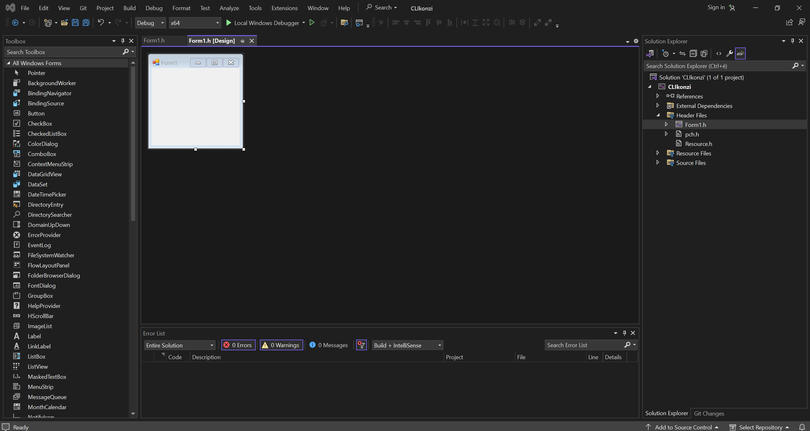
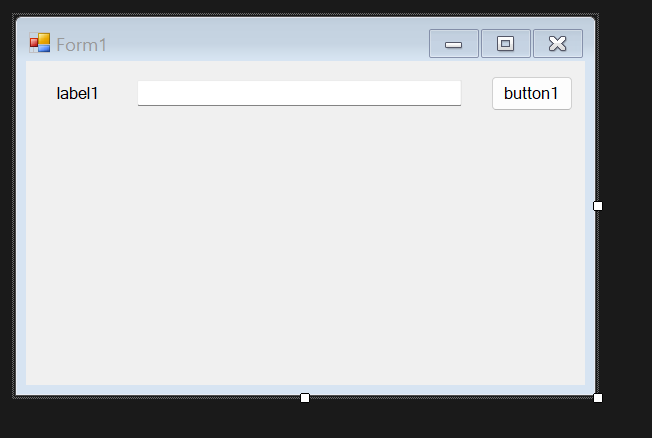
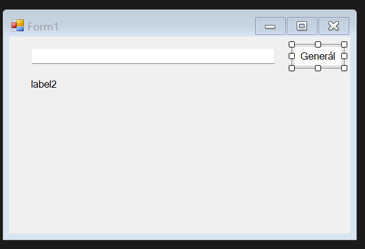
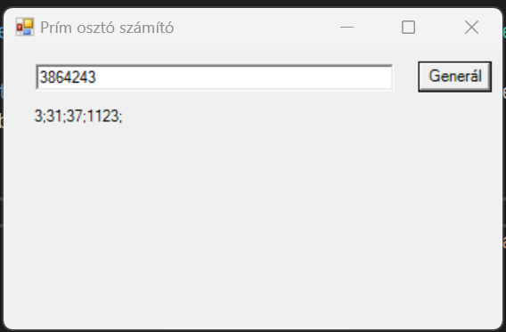

# Grafikus Felületek 1. ZH anyaga

## C++/CLI nyelv alapjai

A C++/CLI a Microsoft külön programnyelve, amivel a .NET platformra lehet C++ kódot írni. Emiatt gyakran a C# nyelvhez szokták hasonlítani.  

A C++/CLI egyik legfontosabb különbsége az, hogy a C++ alap típusai változtak: habár azonos a nevük, valójában osztályok. Az olyan átalakítások, mint a `double(valtozo)` helyett a `Convert::ToDouble`-höz hasonló szintaxot kell használni, valamint körülbelül minden típusnak van `.ToString()` tagfüggvénye.  

Ezen kívül a pointerek is mások lettek: azért, hogy ne kelljen a `delete`-t hívni mindenen, speciális típusok egy ú.n. garbage collector (GC) használatával szabadulnak fel. Ezeket csillag helyett a `^` karakterrel jelöljük, létrehozásuknál a `gcnew` kulcsszót használjuk:

~~~C++
String^ osztaly = gcnew String;

osztaly += L"ő-t használhatsz, ha az idézőjel előtt van L";
osztaly += label1->Text;

// nincs delete :)
~~~

Amint látni lehet, a `String` most nagy betűvel van, ugyanis a C++/CLI más osztályokkal dolgozik, mint amiket mi kezeltünk még MOO keretein belül (habár azok is alkalmazhatóak egyes esetekben).
A következők a legfontosabbak:

- `String`: szövegek
- `cli::array<T>^`: dinamikus tömb
- `List<T>^`: bővíthető tömb, mint a C++ vector
- `Random`: random számgenerátor
- `StreamWriter` és `StreamReader`: fájl írás és olvasás
- `CultureInfo`: a nyelvektől függő beállítások (pl.: CSV elválasztókarakter) lekérése

Ezen kívül az osztályainknak egy új tulajdonság beállítása van: a `property`. Egy propertyvel úgy tudunk egy függvényt hívni az osztályon, mintha egy adattag lehetne. Egy property rendelkezhet egy `get()` és egy `set(ertek)` függvénnyel, amivel például privát elemeket lehet módosítani az osztályban.

---

### Példa: C++ kód átalakítása C++/CLI-be

Feladat: Készítjünk egy pénzügyi adatfeldolgozó osztályt! A konstruktor kérjen egy stringet, ami megadja az osztálynak, hogy melyik (CSV formátumú) fájlt olvassa be!  
A fájl soraból olvasd ki `bevetel;kiadas` formátumban az akkori bevételeket, kiadásokat (ezek double-ök)!  
Az osztálynak csinálj 3 függvényt, amik:

- Visszaadják, hogy hány elem van
- Visszaadják az átlagos profitot ($\sum bevetel - \sum kiadas\over{elemszam}$)

C++ megoldás:

~~~C++
#include <iostream>
#include <string>
#include <fstream>
#include <sstream>

using namespace std;

class adatfeldolgozo {
    double bevetelek, kiadasok;
    unsigned int elemszam;
public:
    adatfeldolgozo(string fajlnev) :
    bevetelek(0), kiadasok(0), elemszam(0) {
        ifstream fajl(fajlnev);
        stringstream converter;
        string sor;
        if (!fajl.is_open()) {
            cout << "Nem sikerult a(z) \"" <<
            fajlnev << "\" fajlt megnyitni!" << endl;
            exit(-1);
        }

        while (!fajl.eof()) {
            getline(fajl, sor);
            if (sor.length() == 0) continue;

            string bevs, kiads;
            size_t elvHely = sor.find(";");
            if (elvHely == string::npos) continue;
            bevs = sor.substr(0, elvHely);
            kiads = sor.substr(elvHely + 1);

            double tempBev, tempKiad;
            converter << bevs << endl;
            converter >> tempBev;

            converter << kiads << endl;
            converter >> tempKiad;

            elemszam++;
            bevetelek += tempBev;
            kiadasok += tempKiad;
        }

        fajl.close();
    }

    unsigned int elemek() { return elemszam; }

    double atlagprofit() {
        return (bevetelek - kiadasok) / elemszam;
    }

};

const string inputfajl = "ZH 1\\feladatok\\adat3.csv";

int main() {
    adatfeldolgozo adatok(inputfajl);
    
    cout << adatok.elemek() << " elembol " <<
    adatok.atlagprofit() << " Ft atlag profit lett" << endl;
}
~~~

---

Ehhez képest a C++/CLI a következő módon csinálja:

~~~C++
#include "pch.h"
using namespace System::IO;
using namespace System::Windows;
using namespace System;
using namespace System::Globalization;

ref class adatfeldolgozo {
    double bevetelek, kiadasok;
    unsigned int elemszam;
public:
    adatfeldolgozo(String^ fajlnev): elemszam(0), bevetelek(0), kiadasok(0) {
        // ahhoz, hogy tizedespontot olvassunk, amerikai kultúrát
        // fogunk használni string-double átalakításnál
        // (ha tizedesvesszőt olvasunk, ezt nem kell)
        CultureInfo^ kultura = gcnew CultureInfo("en-US");

        // Ha nincs fájl, akkor kilépünk errorral
        if (!File::Exists(fajlnev)) {
            Console::WriteLine("ERROR! " + fajlnev + L" nevű fájlt" +
            L"nem sikerült megnyitni!");
            // Formoknál Application::Exit lesz
            System::Environment::Exit(-1);
        }

        StreamReader^ olvaso = gcnew StreamReader(fajlnev);

        // Átmegyünk a fájlon
        String^ sor = "";
        while (!olvaso->EndOfStream) {
            sor = olvaso->ReadLine();
            // nem kell ujadat() vagy más feldolgozó megoldás
            cli::array<String^>^ sorelemek = sor->Split(';');
            
            // ellenőrizzük, hogy tényleg 2 elem van-e
            if (sorelemek->Length != 2) continue;

            elemszam++;
            const double tempBev = Convert::ToDouble(sorelemek[0], kultura);
            const double tempKi = Convert::ToDouble(sorelemek[1], kultura);

            bevetelek += tempBev;
            kiadasok += tempKi;
        }

        olvaso->Close();
    }

    // property <tipus> nev
    property int elemek {
        // mintha a get adattag értékét keresnénk
        int get() { return elemszam; }
    }

    property double atlagProfit {
        double get() { return (bevetelek - kiadasok) / elemszam; }
    }
};

int main(array<System::String ^> ^args)
{
    String^ fajlnev = "adat3.csv";
    adatfeldolgozo^ adatok = gcnew adatfeldolgozo(fajlnev);

    Console::WriteLine(Convert::ToString(adatok->elemek) + L" elemből" +
        L" átlagosan " + Convert::ToString(adatok->atlagProfit) +
        " profit lett");
}
~~~

---

## Grafikus Felületek Alapjai

A C++/CLI legfőbb előnye az, hogy relatíve egyszerűen tudunk benne grafikus felületű programokat fejleszteni. Ehhez a `WindowsForm` nevű sablont fogjuk alkalmazni, ami az első pár lépést helyettünk megcsinálja.  
A létrehozott projekt a következőképpen fog kinézni:

A fájlok közül a munkánk a `Form1.h` fájlban fog történni. Ezt a fájlt egyszerre két módon fogjuk megtekinteni: kód és vizuális szerkesztő módban.
Ezek között a `View` tab `Code` és `Designer` gombjaival lehet váltani.  
A vizuális szerkesztőben lehet az ablakunkra elemeket (pl.: gombokat) rakni. A jobb oldali listában találhatóak ezek, de csak párat kell majd ismerni, és használni:

- Button: Gomb, ha megnyomod, akkor egy függvényt hív
- Label: Szöveg, ezzel tudunk majd a felhasználónak írni
- TextBox: Szövegdoboz, amibe lehet írni
- CheckBox: Igen/Nem pipálható elem
- PictureBox: Majd rajzolásnál fogjuk alkalmazni
- StatusStrip és ToolStrip: Alsó/Felső csíkok a képernyőn, ahova gombokat lehet rakni majd (pl.: mint Fájl, Nézet, Beszúrás tabok Wordben)
- ProgressBar: Folyamat állapotát megjelenítheti (pl.: Zöld csík programok installálásakor)

Ezeken kívül van pár, amit nem lehet a formon látni, de hasznosak:

- Timer: időzítő, $n$ milliszekundumonként lehet kódot futtatni, ki/be kapcsolható
- OpenFileDialog: Fájl megnyitásánál megjelenő fájlkezelő ablak

A toolbox elemeit szabadon lehet elhelyezni a form területén.

Az elemeknek a `Properties` ablakban, vagy kódban lehet beállítani a kezdeti paramétereit

Ahhoz, hogy függvényeket kössünk egyes eseményekhez, vagy a `Properties->Events` alablakban duplát kattintunk egy eseménytípusra, vagy a Form egyik elemére duplát kattintunk, és akkor az alapértelmezett eseményéhez generál egy függvényt. A két leggyakoribb a Button OnClick (gombnyomás) és a From Load (betöltés) eseménye szokott lenni.

---

### Példa: Szám prím osztóinak keresése

Csinálj egy ablakot, ahol egy egész számot tudsz írni, és gombnyomásra pontosvesszővel elválasztva kiírja a szám osztóit!

**Első lépés: ablak elemeinek létrehozása**

Biztosan kell nekünk

- Egy gomb
- Egy szövegdoboz (bemenet)
- Egy szöveg (kimenet)

Az ablakunk a következő módon néz ki:

**Második lépés: alap beállítások**

A Formra 2 kattintással létre tudunk hozni egy `Form1_Load()` függvényt, amibe be tudjuk állítani az alap értékeket mindennek:

~~~C++
// ...
private: System::Void Form1_Load(System::Object^ sender, System::EventArgs^ e) {
    this->Text = L"Prím osztó számító";
    label1->Text = "";
    button1->Text = "Generál";
}
// ...
~~~

**Harmadik lépés: Osztószámoló megírása**

Gombnyomáskor be tudjuk olvasni az ottani számot egy int változóba, és akkor egy while és egy for ciklussal ki tudjuk írni az osztóit a következő algoritmussal:

~~~C++
private: System::Void button1_Click(System::Object^ sender, System::EventArgs^ e) {
    // Érték beolvasása
    int mostSzam = Convert::ToInt32(textBox1->Text);
    
    // Reset, hogy akárhányszor csinálhassuk
    label1->Text = "";

    // Ha rossz az érték, kilépünk
    // a függvényből, nem az alkalmazásból
    if (mostSzam < 2) {
        // Hiba megjelenítő ablak
        MessageBox::Show(L"Rossz érték lett megadva!", "Error", MessageBoxButtons::OK);
        return;
    }

    // Addig megyünk, amíg minden osztóval nem
    // osztottuk a számít (amíg nem 1)
    while (mostSzam != 1) {
        // Megyünk, amíg osztót nem találunk
        // mivel a legkisebb osztót találja
        // először, mindig prímmel osztunk
        for (int i = 2; i <= mostSzam; i++) {
            if (mostSzam % i == 0) {
                label1->Text += Convert::ToString(i) + ";";
                mostSzam /= i;
                break;
            }
        }
    }
}
~~~

**Eredmény:**

