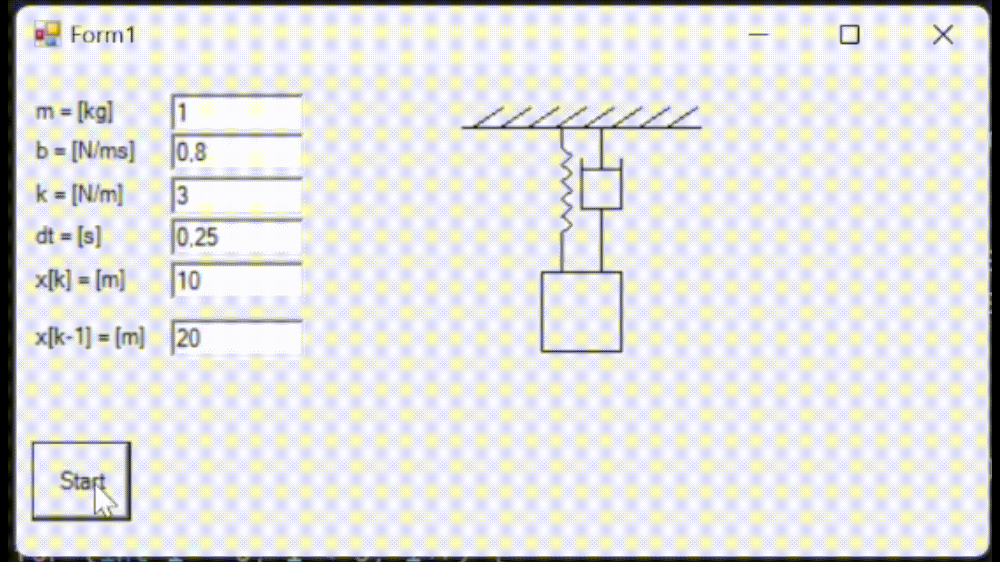

# Feladatok az 1. GP ZH-hoz

## Rezgéstan 2

Csinálj az első rezgéstani szimulációhoz egy hasonlót, de most jól is nézzen ki (szabványos rugó/csillapítás elemekkel, felfüggesztéssel), valamint forgasd el 90°-kal, hogy
a tömegre gravitáció is hasson!

Szükséges képletek:

$$m\ddot{x}(t)+b\dot{x}(t)+kx(t)=mg$$

$$\dot{x} \Rightarrow \frac{x[k+1]-x[k]}{\Delta t}$$

Diszkrét időben:

$$m\cdot\frac{x[k+2]-2x[k+1]+x[k]}{\Delta t^2}+b\cdot\frac{x[k+1]-x[k]}{\Delta t}+k\cdot x[k]=mg$$

$$x[k] = 2x[k+1]-x[k-2]
+ \frac{\Delta t\cdot b}{m}\cdot(-x[k-1]+x[k-2])
- \frac{\Delta t^2\cdot k}{m}\cdot x[k-2]
+ \Delta t^2\cdot g$$

Példa arra, hogy az eredmény hogy nézhet ki:

## Conway's game of life

Csináld meg [Conway életjátékát](https://en.wikipedia.org/wiki/Conway%27s_Game_of_Life)! Legyen a képernyőn egy fekete PictureBox, ami a 20x20-as cellákból álló, 400x400 px-es játéktér lesz. Ha ide kattintasz, egy adott cella értékét invertálod (fekete cella halott, fehér élő).
A PictureBox alatt egy gomb legyen, amivel ki-be lehet kapcsolni a szimulációt.

Egy szimulációs lépés a következő módon néz ki:

- Ha egy élő cellának kevesebb, mint kettő élő szomszédja van, akkor meghal
- Ha egy élő cellának kettő vagy három élő szomszédja van, akkor életben marad
- Ha egy halott cellának három élő szomszédja van, életre kel
- Ha egy élő cellának több, mint három élő szomszédja van, akkor meghal

Ha be van kapcsolva a szimuláció, 250 ms-enként frissüljön a képernyő az új állapotra.
